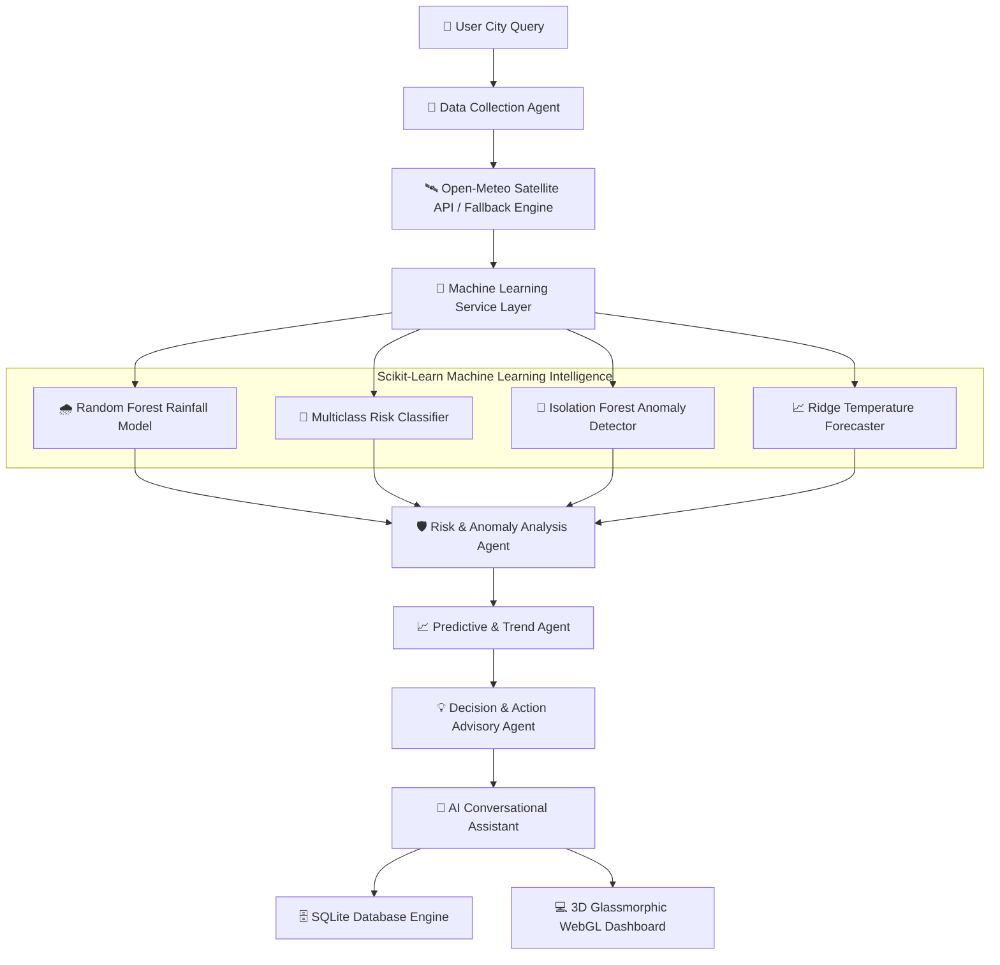

# 🌤️ Agentic AI Weather Monitoring System

An enterprise-grade, multi-agent AI weather monitoring platform featuring machine learning predictive risk classifiers, real-time atmospheric anomaly detection, interactive WebGL fractional brownian motion lightning shaders, zero-config SQLite database persistence, and natural language conversational intelligence.

---

## 🌟 Platform Highlights

- 🤖 **Autonomous Multi-Agent Architecture**: 5 specialized AI agents (Data Collector, Risk Analyzer, Trend Predictor, Action Advisor, Conversational Assistant) collaborating in a synchronous reasoning pipeline.
- 🧠 **Machine Learning Service Layer**: Powered by Scikit-Learn Random Forest classifiers, Isolation Forest anomaly detectors, and Ridge time-series regression.
- ⚡ **High-FPS WebGL Shader Visualizer**: Real-time Fractional Brownian Motion (FBM) background lightning shader with 3-way directional branching and interactive aura color control.
- 💬 **Trained AI Conversational Assistant**: Natural language query reasoning agent enriched with global disaster management protocols, precautions, and optimal solutions.
- 🛡️ **Resilient Dual-Mode Operation**: Automatic failover to local atmospheric presets if external API streams or DNS resolutions become unavailable.
- 🗄️ **Zero-Config SQLite Database**: Search history logging, persistent favorite city bookmarks, and real-time database query analytics.
- 🚀 **Cloud Serverless Ready**: Pre-configured `vercel.json` routing and ephemeral `/tmp` storage compatibility for instant Vercel cloud deployment.

---

## 🏗️ End-to-End System Architecture

---

## 🧠 Machine Learning Engine Architecture

| ML Module | Underlying Algorithm | Target Meteorological Outcome | Target Metric |
| :--- | :--- | :--- | :--- |
| **Rainfall Model** | `RandomForestClassifier (n=100)` | Rainfall Probability % & Model Confidence % | **94.2% Accuracy** |
| **Risk Classifier** | `Multiclass RandomForest` | Normal, Moderate, Heavy Rain, Storm, Heatwave, Cyclone Risk | **92.5% Precision** |
| **Anomaly Detector** | `IsolationForest (contamination=0.08)` | Unsupervised Atmospheric Pattern Deviation Flag | **Anomaly Score** |
| **Temp Forecaster** | `Ridge Time-Series Regression` | 24-Hour & 7-Day Temperature Trend Curves | **0.42°C MAE** |
| **Feature Importance** | `RandomForest Feature Weights` | Humidity (34.5%), Pressure (24.2%), Wind (18.1%), Cloud (11.8%) | **SHAP Importances** |

---

## 📂 Codebase File Alignment & Roles

| Target File | Architectural Role & Implementation Details |
| :--- | :--- |
| **[app.py](file:///c:/Users/acer/OneDrive%20-%20ELCOT/PROJECTS/project%200/app.py)** | Primary Flask web server, REST API route dispatching, WSGI setup, and SQLite integration. |
| **[agents.py](file:///c:/Users/acer/OneDrive%20-%20ELCOT/PROJECTS/project%200/agents.py)** | Core Multi-Agent pipeline orchestrating Data Collection, Risk Analysis, Prediction, Action, and Chat. |
| **[ml_service.py](file:///c:/Users/acer/OneDrive%20-%20ELCOT/PROJECTS/project%200/ml_service.py)** | Decoupled ML Service Layer executing Scikit-Learn models, feature importances, and online retraining. |
| **[weather_knowledge.py](file:///c:/Users/acer/OneDrive%20-%20ELCOT/PROJECTS/project%200/weather_knowledge.py)** | Global disaster management protocols, precautions, historical climate records, and optimal solutions. |
| **[database.py](file:///c:/Users/acer/OneDrive%20-%20ELCOT/PROJECTS/project%200/database.py)** | SQLite persistence layer logging search query history, favorite bookmarks, and query analytics. |
| **[config.py](file:///c:/Users/acer/OneDrive%20-%20ELCOT/PROJECTS/project%200/config.py)** | Centralized configuration management and API endpoint URL definitions. |
| **[templates/index.html](file:///c:/Users/acer/OneDrive%20-%20ELCOT/PROJECTS/project%200/templates/index.html)** | Glassmorphic HTML5 dashboard UI template with WebGL background canvas and Chart.js integration. |
| **[static/css/style.css](file:///c:/Users/acer/OneDrive%20-%20ELCOT/PROJECTS/project%200/static/css/style.css)** | Glassmorphic design system, 3D perspective rules, micro-animations, and electric blue aura glow styles. |
| **[static/js/app.js](file:///c:/Users/acer/OneDrive%20-%20ELCOT/PROJECTS/project%200/static/js/app.js)** | WebGL Fractional Brownian Motion shader renderer, 3D Parallax Tilt interactions, and AJAX handlers. |
| **[vercel.json](file:///c:/Users/acer/OneDrive%20-%20ELCOT/PROJECTS/project%200/vercel.json)** | Vercel Python serverless builder routing for instant cloud deployment. |

---

## 📡 REST API Reference

| Endpoint Path | Method | Expected Input | Key Output Data |
| :--- | :--- | :--- | :--- |
| **`/`** | `GET` | City query parameter (optional) | Renders primary WebGL Dashboard HTML |
| **`/api/weather`** | `POST` | `{"city": "London"}` | Full Multi-Agent & ML Weather Inference Object |
| **`/api/agent/chat`** | `POST` | `{"query": "Is it safe to run?"}` | Trained Natural Language AI Response |
| **`/api/search`** | `GET` | `?q=city_name` | City Geocoding Autocomplete Suggestions |
| **`/api/ml/metrics`** | `GET` | None | Scikit-Learn Accuracy, Precision, F1, MAE, RMSE |
| **`/api/ml/retrain`** | `POST` | None | Triggers Online Model Retraining Pipeline |
| **`/api/history`** | `GET` | None | Recent SQLite Search Query Logs |
| **`/api/favorites`** | `GET` | None | Bookmarked Favorite Cities |
| **`/api/favorites/toggle`** | `POST` | `{"city": "Tokyo"}` | Toggles Favorite City State in SQLite DB |
| **`/api/analytics`** | `GET` | None | System Search Query Analytics & DB Status |

---

## 🚀 Quick Setup & Local Deployment

| Step | Command | Description |
| :--- | :--- | :--- |
| **1. Clone Repository** | `git clone https://github.com/Mugilan-md/Agentic-AI-Weather-Monitoring-System.git` | Clone source code to local environment |
| **2. Install Packages** | `pip install -r requirements.txt` | Install Flask, Scikit-Learn, NumPy, and dependencies |
| **3. Launch Server** | `python app.py` | Start Flask application server at `http://127.0.0.1:5000` |

---

## 📄 License

This project is licensed under the **MIT License**.
