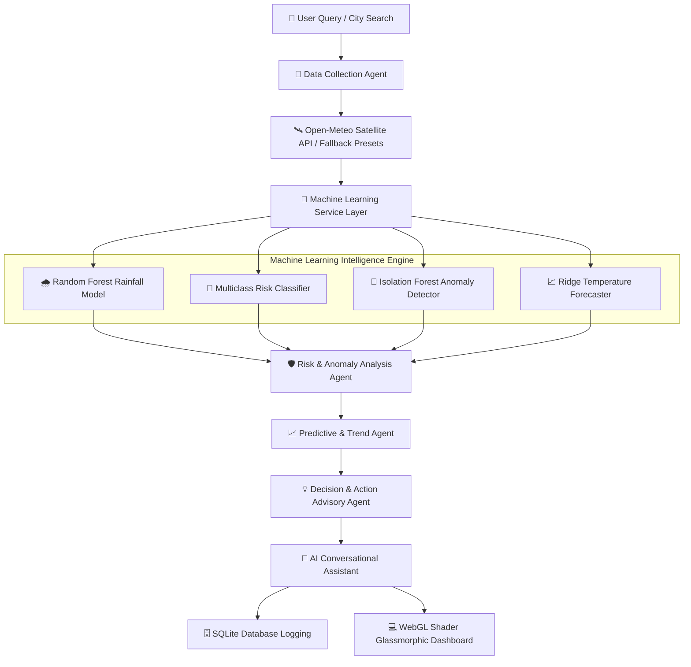

# 🌤️ Agentic AI Weather Monitoring System

An enterprise-grade, multi-agent AI weather monitoring platform featuring machine learning predictive models, real-time atmospheric anomaly detection, interactive WebGL shaders, zero-config SQLite persistence, and natural language conversational intelligence.

---

## 🌟 Key System Capabilities

- 🤖 **Autonomous Multi-Agent Pipeline**: 5 specialized AI agents (Data Collector, Risk Analyzer, Trend Predictor, Action Advisor, Conversational Assistant) collaborating synchronously.
- 🧠 **Machine Learning Service Layer**: Powered by Scikit-Learn Random Forest classifiers, Isolation Forest anomaly detectors, and Ridge time-series regression.
- ⚡ **High-FPS WebGL Shader Visualizer**: Real-time Fractional Brownian Motion (FBM) lightning background shader with 3-way directional branching.
- 💬 **AI Conversational Weather Assistant**: Natural language query reasoning agent providing instant safety, activity, and outfit advisories.
- 🛡️ **Resilient Dual-Mode Operation**: Automatic fallback to local atmospheric presets if external API or DNS resolution drops.
- 🗄️ **Zero-Config SQLite Persistence**: Built-in search query logging, persistent favorite city bookmarks, and system analytics.
- 🚀 **Serverless Vercel Ready**: Pre-configured `vercel.json` and ephemeral `/tmp` storage handling for instant cloud deployment.

---

## 🏗️ System Architecture & Data Flow



---

## 📂 Project Directory Structure & File Alignment

| File Path | Description & Architectural Responsibility |
| :--- | :--- |
| **[app.py](file:///c:/Users/acer/OneDrive%20-%20ELCOT/PROJECTS/project%200/app.py)** | Primary Flask web server, REST API routing, WSGI entry point, and endpoint orchestrator. |
| **[agents.py](file:///c:/Users/acer/OneDrive%20-%20ELCOT/PROJECTS/project%200/agents.py)** | Core Agentic AI Pipeline (Data Collection, Risk Analysis, Predictive, Action, and Conversational Agents). |
| **[ml_service.py](file:///c:/Users/acer/OneDrive%20-%20ELCOT/PROJECTS/project%200/ml_service.py)** | Machine Learning Service Layer (Random Forest, Isolation Forest, Feature Importance, Model Retraining). |
| **[database.py](file:///c:/Users/acer/OneDrive%20-%20ELCOT/PROJECTS/project%200/database.py)** | SQLite persistence layer handling query history logging, favorite bookmarks, and analytics. |
| **[config.py](file:///c:/Users/acer/OneDrive%20-%20ELCOT/PROJECTS/project%200/config.py)** | Centralized configuration management and API endpoint definitions. |
| **[templates/index.html](file:///c:/Users/acer/OneDrive%20-%20ELCOT/PROJECTS/project%200/templates/index.html)** | Responsive HTML5 dashboard UI template with WebGL canvas, metric cards, and ML panels. |
| **[static/css/style.css](file:///c:/Users/acer/OneDrive%20-%20ELCOT/PROJECTS/project%200/static/css/style.css)** | Glassmorphic design system, color tokens, micro-animations, and layout styles. |
| **[static/js/app.js](file:///c:/Users/acer/OneDrive%20-%20ELCOT/PROJECTS/project%200/static/js/app.js)** | WebGL Lightning Shader renderer, Chart.js trends graph, AJAX pipeline, and chat handlers. |
| **[vercel.json](file:///c:/Users/acer/OneDrive%20-%20ELCOT/PROJECTS/project%200/vercel.json)** | Deployment configuration for Vercel Python serverless hosting. |
| **[requirements.txt](file:///c:/Users/acer/OneDrive%20-%20ELCOT/PROJECTS/project%200/requirements.txt)** | Python dependencies list (`flask`, `requests`, `python-dotenv`, `numpy`, `scikit-learn`). |

---

## 📡 REST API Reference

| Endpoint | Method | Description |
| :--- | :--- | :--- |
| `/` | `GET` | Renders the primary weather dashboard UI. |
| `/api/weather` | `POST` | Executes the complete Multi-Agent & ML pipeline for a requested city. |
| `/api/agent/chat` | `POST` | Processes natural language questions via the Conversational AI Agent. |
| `/api/search` | `GET` | Returns city autocomplete suggestions. |
| `/api/ml/metrics` | `GET` | Returns ML model accuracy, precision, recall, F1-score, MAE, and feature importances. |
| `/api/ml/retrain` | `POST` | Triggers the online ML model retraining pipeline. |
| `/api/history` | `GET` | Retrieves recent search query history logs from SQLite database. |
| `/api/favorites` | `GET` | Returns saved favorite bookmarked cities. |
| `/api/favorites/toggle` | `POST` | Adds or removes a city from SQLite favorite bookmarks. |
| `/api/analytics` | `GET` | Returns system query analytics and SQLite database status. |

---

## 🛠️ Quick Local Execution Guide

1. **Clone the Repository**:
   ```bash
   git clone https://github.com/Mugilan-md/Agentic-AI-Weather-Monitoring-System.git
   cd Agentic-AI-Weather-Monitoring-System
   ```

2. **Install Dependencies**:
   ```bash
   pip install -r requirements.txt
   ```

3. **Start Application Server**:
   ```bash
   python app.py
   ```

4. **Access Dashboard**:
   Open **`http://127.0.0.1:5000`** in your browser.

---

## 📄 License
This project is released under the **MIT License**.
