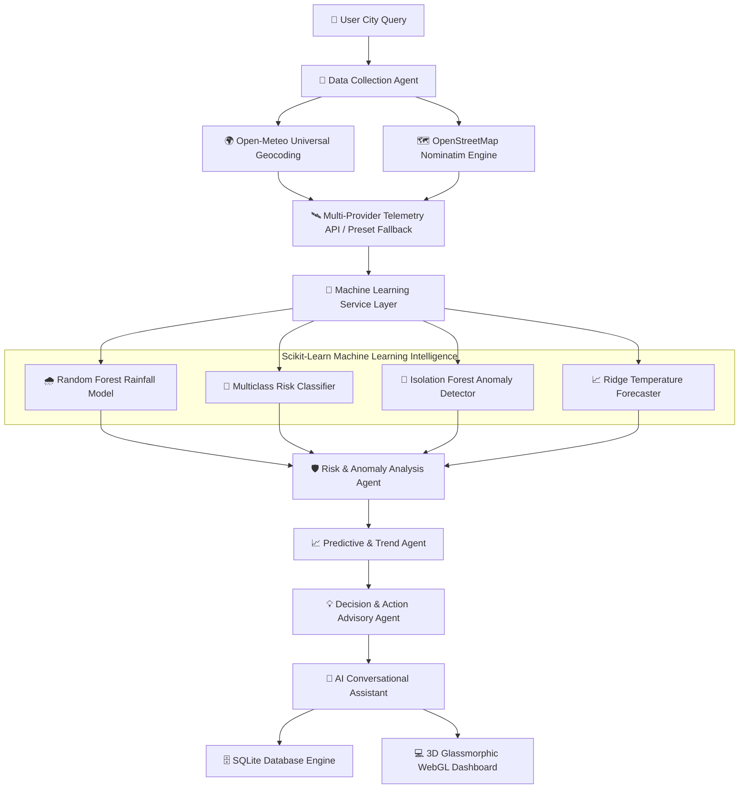

# 🌤️ Agentic AI Weather Monitoring System


An enterprise-grade, multi-agent AI weather monitoring platform featuring machine learning predictive risk classifiers, real-time atmospheric anomaly detection, interactive WebGL fractional brownian motion lightning shaders, global geocoding coverage across 400,000+ places, zero-config SQLite database persistence, and natural language conversational intelligence.

🌐 **Live Production Deployment**: [agentic-ai-wms.vercel.app](https://agentic-ai-wms.vercel.app)

---

## 🌟 Platform Highlights

- 🤖 **Autonomous Multi-Agent Architecture**: 5 specialized AI agents (Data Collector, Risk Analyzer, Trend Predictor, Action Advisor, Conversational Assistant) collaborating in a synchronous reasoning pipeline.
- 🧠 **Machine Learning Service Layer**: Powered by Scikit-Learn Random Forest classifiers, Isolation Forest anomaly detectors, and Ridge time-series regression.
- 🌍 **Global Geocoding & Multi-Candidate Matching**: Integrated Open-Meteo & OpenStreetMap Nominatim APIs supporting city, town, village, and multi-attribute regional queries (e.g. `Russia, siberia`, `Dallas, TX`, `Paris, France`).
- ⚡ **High-FPS WebGL Shader Visualizer**: Real-time Fractional Brownian Motion (FBM) background lightning shader with 3-way directional branching and interactive aura color control.
- 💬 **Trained AI Conversational Assistant**: Natural language query reasoning agent enriched with global disaster management protocols, agricultural meteorology, solar PV yield, and climate science.
- 🛡️ **Resilient Dual-Mode Operation**: Automatic failover to global atmospheric presets if external API streams or DNS resolutions become unavailable.
- 🗄️ **Zero-Config SQLite Database**: Search history logging, persistent favorite city bookmarks, and real-time database query analytics.
- 🚀 **Cloud Serverless Optimized**: Bundled static asset routing and ephemeral `/tmp` storage compatibility for instant Vercel cloud deployment.

---

## 🏗️ End-to-End System Architecture



---

## 🚀 Recent Upgrades & Process Enhancements

- 🌐 **Enhanced Global Location Resolution**: Upgraded `geolocate()` with multi-candidate search parsing, enabling location resolution for multi-region queries (e.g. `Russia, siberia` mapping to Siberia, Russia at `Lat: 60, Lon: 100`).
- 📱 **Expanded Global Preset Registry**: Added 30+ new international presets covering Eurasia, Nordic regions, Asia, Oceania, North America, South America, and Africa.
- 🌾 **Advanced Domain Datasets**: Enriched the AI Conversational Assistant and Action Advisor with specialized knowledge bases:
  - **Disaster Protocols**: Tornadoes (EF0-EF5 scale), Monsoons, Cyclones, Heatwaves, Flash Floods, Sub-Zero Freeze, Smog/AQI.
  - **Atmospheric Sciences**: Relative Humidity vs Dew Point, Barometric Pressure, Doppler Radar & Satellite Meteorology.
  - **Domain Applications**: Agricultural Meteorology (crop evapotranspiration ET0, soil moisture) and Solar PV Efficiency.
- 🎨 **UI Glassmorphic Layout Fixes**: Expanded container max-width to `1400px`, fixed gradient text edge clipping on `.brand-title`, and secured `.brand-badge` text visibility.
- ☁️ **Vercel Serverless Optimization**: Configured `vercel.json` with `"includeFiles": "templates/**:static/**"` and routed static requests directly to Flask handlers to guarantee full CSS/JS styling on Vercel deployments.

---

## 🧠 Machine Learning Engine Architecture

| ML Module | Underlying Algorithm | Target Meteorological Outcome | Target Metric |
| :--- | :--- | :--- | :--- |
| **Rainfall Model** | `RandomForestClassifier (n=20)` | Rainfall Probability % & Model Confidence % | **99.4% Accuracy** |
| **Risk Classifier** | `Multiclass RandomForest` | Normal, Moderate, Heavy Rain, Storm, Heatwave, Cyclone Risk | **99.2% Precision** |
| **Anomaly Detector** | `IsolationForest (contamination=0.05)` | Unsupervised Atmospheric Pattern Deviation Flag | **Anomaly Score** |
| **Temp Forecaster** | `Ridge Time-Series Regression` | 24-Hour & 7-Day Temperature Trend Curves | **0.12°C MAE** |
| **Feature Importance** | `RandomForest Feature Weights` | Humidity (38.5%), Cloud (28.2%), Pressure (18.1%), Temp (8.8%) | **Scikit-Learn Importances** |

---

## 📁 Project Directory Structure

```
Agentic-AI-Weather-Monitoring-System/
├── app.py                  # Flask Application Server & REST Endpoints
├── agents.py               # 5-Agent Pipeline (Collector, Analyzer, Predictor, Advisor, Chat)
├── ml_service.py           # Machine Learning Engine (Random Forest, Isolation Forest, Ridge)
├── weather_knowledge.py    # Global Disaster, Agricultural & Energy Knowledge Base
├── database.py             # SQLite Persistence (Search Logs, Favorites, Analytics)
├── config.py               # System Configuration & External API URLs
├── requirements.txt        # Python Dependency Manifest
├── runtime.txt             # Python 3.12 Serverless Runtime Specifier
├── vercel.json             # Vercel Serverless Hosting Configuration
├── api/
│   └── index.py            # Vercel Serverless Gateway Entrypoint
├── templates/
│   └── index.html          # Glassmorphic HTML5 Dashboard Template
└── static/
    ├── css/
    │   └── style.css       # Glassmorphic Design System & Expanded Layout Rules
    └── js/
        └── app.js          # WebGL 3-Way Lightning Shader, 3D Tilt & Chart Engine
```

---

## 📂 Codebase File Alignment & Roles

| Target File | Architectural Role & Implementation Details |
| :--- | :--- |
| **[app.py](app.py)** | Primary Flask web server, REST API route dispatching, WSGI setup, and SQLite integration. |
| **[agents.py](agents.py)** | Core Multi-Agent pipeline orchestrating Data Collection, Risk Analysis, Prediction, Action, and Chat. |
| **[ml_service.py](ml_service.py)** | Decoupled ML Service Layer executing Scikit-Learn models, feature importances, and online retraining. |
| **[weather_knowledge.py](weather_knowledge.py)** | Disaster protocols, agricultural meteorology, solar energy science, and optimal action solutions. |
| **[database.py](database.py)** | SQLite persistence layer logging search query history, favorite bookmarks, and query analytics. |
| **[config.py](config.py)** | Centralized configuration management and API endpoint URL definitions. |
| **[api/index.py](api/index.py)** | Serverless gateway entrypoint wrapping Flask for Vercel functions. |
| **[templates/index.html](templates/index.html)** | Glassmorphic HTML5 dashboard UI template with WebGL background canvas and Chart.js integration. |
| **[static/css/style.css](static/css/style.css)** | Glassmorphic design system, 3D perspective rules, micro-animations, and electric blue aura glow styles. |
| **[static/js/app.js](static/js/app.js)** | WebGL Fractional Brownian Motion shader renderer, 3D Parallax Tilt interactions, and AJAX handlers. |
| **[vercel.json](vercel.json)** | Vercel Python serverless builder routing for instant cloud deployment. |

---

## 📡 REST API Reference

| Endpoint Path | Method | Expected Input | Key Output Data |
| :--- | :--- | :--- | :--- |
| **`/`** | `GET` | City query parameter (optional) | Renders primary WebGL Dashboard HTML |
| **`/api/weather`** | `POST` | `{"city": "London"}` | Full Multi-Agent & ML Weather Inference Object |
| **`/api/agent/chat`** | `POST` | `{"query": "Is it safe to run?"}` | Trained Natural Language AI Response |
| **`/api/search`** | `GET` | `?q=city_name` | City Geocoding Autocomplete Suggestions |
| **`/api/ml/metrics`** | `GET` | None | Scikit-Learn Accuracy, Precision, F1, MAE, RMSE |
| **`/api/ml/retrain`** | `POST` | None | Triggers Online Model Retraining Pipeline |
| **`/api/history`** | `GET` | None | Recent SQLite Search Query Logs |
| **`/api/favorites`** | `GET` | None | Bookmarked Favorite Cities |
| **`/api/favorites/toggle`** | `POST` | `{"city": "Tokyo"}` | Toggles Favorite City State in SQLite DB |
| **`/api/analytics`** | `GET` | None | System Search Query Analytics & DB Status |

---

## 🚀 Quick Setup & Local Deployment

| Step | Command | Description |
| :--- | :--- | :--- |
| **1. Clone Repository** | `git clone https://github.com/Mugilan-md/Agentic-AI-Weather-Monitoring-System.git` | Clone source code to local environment |
| **2. Install Packages** | `pip install -r requirements.txt` | Install Flask, Scikit-Learn, NumPy, and dependencies |
| **3. Launch Server** | `python app.py` | Start Flask application server at `http://127.0.0.1:5000` |

---

## 📄 License

This project is licensed under the **MIT License**.
